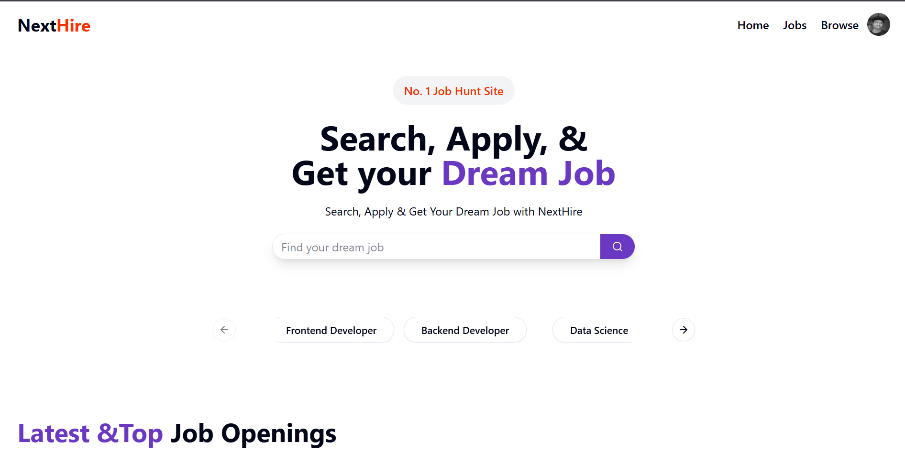
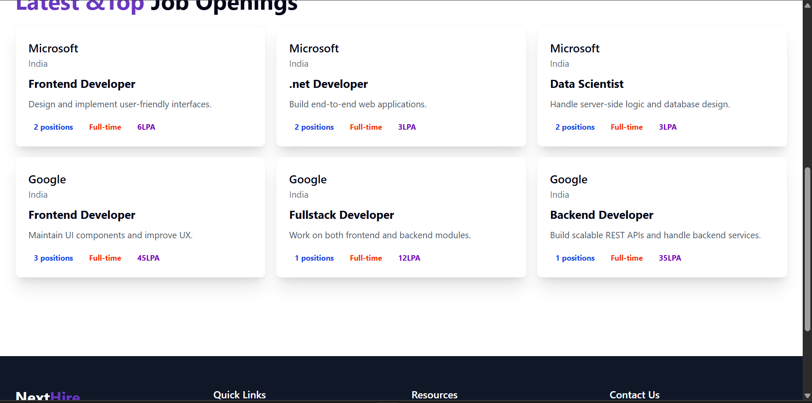
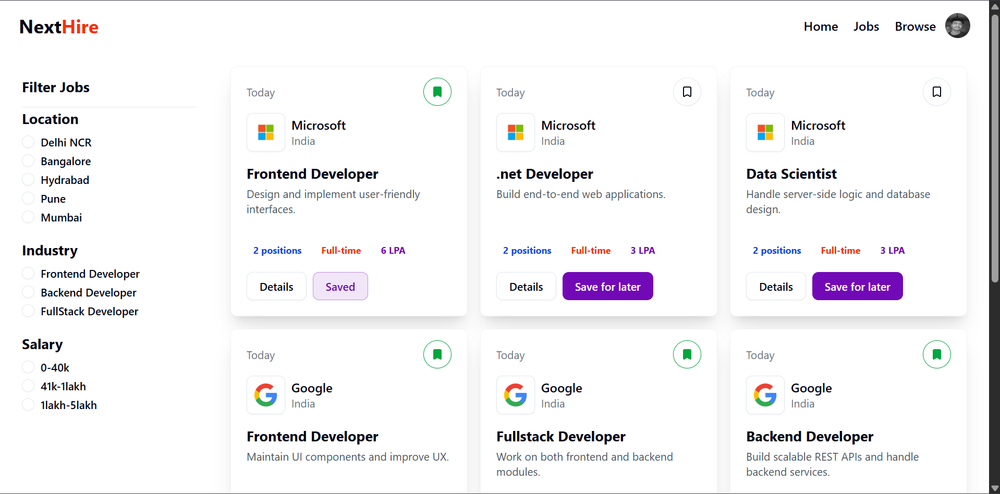
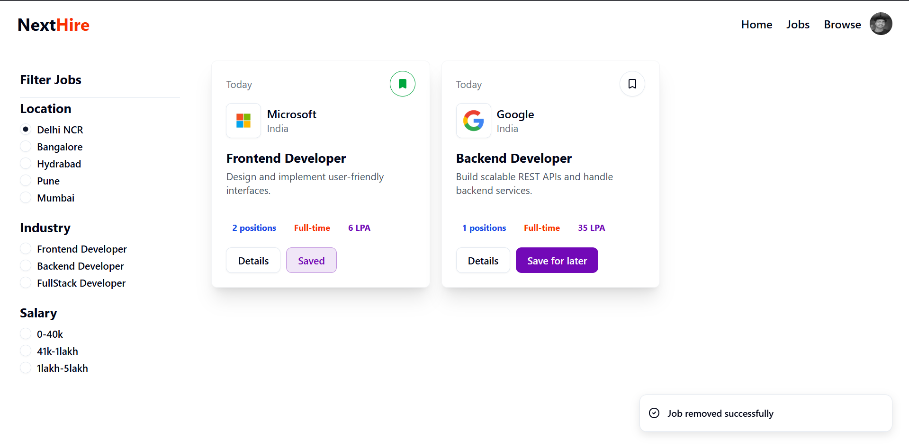
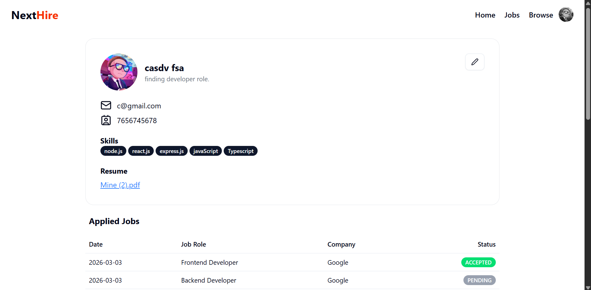
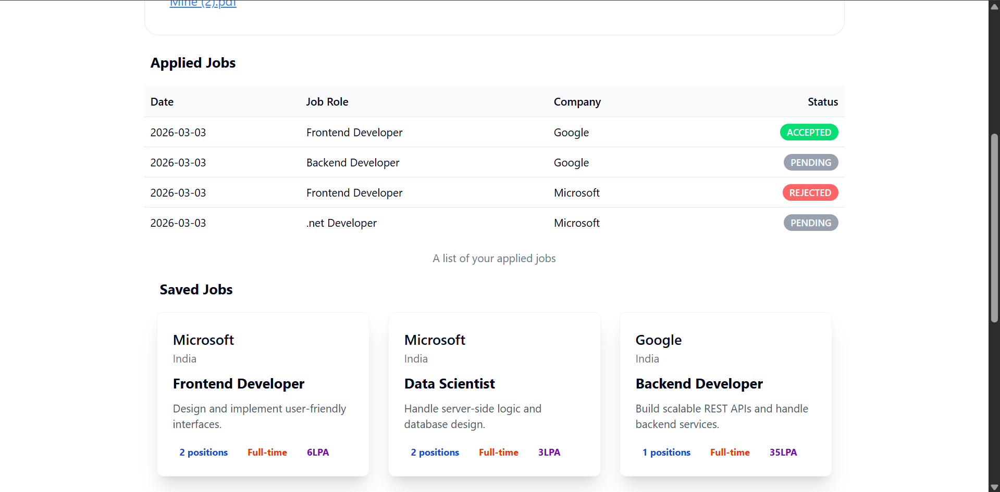
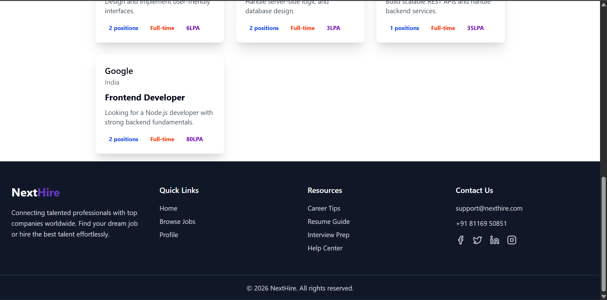

# 🚀 NextHire

**NextHire** is a full-stack **MERN** web application that connects job seekers with recruiters. Users can browse, search, filter, apply for, and save jobs, while recruiters can register companies, post job openings, manage applicants, and update application statuses — all through a modern, responsive interface.

---

## 📑 Table of Contents

- [Features](#-features)
- [Tech Stack](#-tech-stack)
- [Project Structure](#-project-structure)
- [Getting Started](#-getting-started)
- [Environment Variables](#-environment-variables)
- [API Reference](#-api-reference)
- [Database Models](#-database-models)
- [Frontend Architecture](#-frontend-architecture)
- [Screenshots](#-screenshots)
- [Author](#-author)

---

## ✨ Features

### 👤 Job Seeker (Student)

- **Register & Login** with role-based authentication (JWT + HTTP-only cookies)
- **Upload profile photo** during signup (Cloudinary)
- **Browse all jobs** with keyword search
- **Filter jobs** by location, industry, and salary range
- **Search jobs** from the hero section search bar
- **View detailed job descriptions** with company info
- **Apply to jobs** with one click
- **Save / Unsave jobs** for later
- **View applied jobs** with application status tracking (pending / accepted / rejected)
- **View saved jobs** table on profile
- **Update profile** — name, email, phone, bio, skills, resume, and profile photo

### 🏢 Recruiter

- **Register & manage companies** — name, description, website, location, and logo
- **Post new job openings** with title, description, requirements, salary, location, type, experience level, and positions
- **Edit existing jobs** after posting
- **View all applicants** for each job
- **Update application status** (accept / reject applicants)
- **Filter posted jobs and companies** by name

### 🌐 General

- **Responsive design** — works on desktop, tablet, and mobile devices
- **Role-based access control** — recruiters are redirected to admin panel, students to public pages
- **Protected routes** — admin pages are guarded by authentication
- **Smooth animations** — Framer Motion page transitions
- **Toast notifications** — real-time feedback via Sonner
- **Persistent state** — Redux Persist keeps user session across page refreshes
- **Category carousel** — quick job search by category on the home page

---

## 🛠 Tech Stack

### Backend

| Technology        | Purpose                            |
| ----------------- | ---------------------------------- |
| **Node.js**       | JavaScript runtime                 |
| **Express v5**    | Web framework & REST API           |
| **MongoDB**       | NoSQL database                     |
| **Mongoose**      | ODM for MongoDB                    |
| **JWT**           | Authentication via JSON Web Tokens |
| **bcrypt**        | Password hashing                   |
| **Cloudinary**    | Cloud-based image & file storage   |
| **Multer**        | Multipart form-data (file uploads) |
| **DataURI**       | Convert file buffer to Data URI    |
| **cookie-parser** | Parse HTTP cookies                 |
| **CORS**          | Cross-origin resource sharing      |
| **dotenv**        | Environment variable management    |
| **nodemon**       | Development auto-restart           |

### Frontend

| Technology                   | Purpose                                |
| ---------------------------- | -------------------------------------- |
| **React 19**                 | UI library                             |
| **Vite 7**                   | Build tool & dev server                |
| **Tailwind CSS v4**          | Utility-first CSS framework            |
| **shadcn/ui**                | Accessible, customizable UI components |
| **Radix UI**                 | Headless UI primitives                 |
| **Redux Toolkit**            | State management                       |
| **Redux Persist**            | Persist Redux state across sessions    |
| **React Router v7**          | Client-side routing                    |
| **Axios**                    | HTTP client for API calls              |
| **Framer Motion**            | Animation library                      |
| **Lucide React**             | Icon library                           |
| **Embla Carousel**           | Carousel component                     |
| **Sonner**                   | Toast notifications                    |
| **class-variance-authority** | Component variant management           |

---

## 📁 Project Structure

```
NextHire/
├── Backend/
│   ├── controllers/
│   │   ├── application.controller.js   # Apply, get applicants, update status
│   │   ├── company.controller.js       # Register, get, update companies
│   │   ├── job.controller.js           # Post, get, update, search jobs
│   │   └── user.controller.js          # Register, login, logout, profile, saved jobs
│   ├── middlewares/
│   │   ├── isAuthenticated.js          # JWT authentication middleware
│   │   └── multer.js                   # File upload middleware
│   ├── models/
│   │   ├── application.model.js        # Application schema
│   │   ├── company.model.js            # Company schema
│   │   ├── job.model.js                # Job schema
│   │   └── user.model.js               # User schema
│   ├── routes/
│   │   ├── application.route.js        # /api/v1/application
│   │   ├── company.route.js            # /api/v1/company
│   │   ├── job.route.js                # /api/v1/job
│   │   └── user.route.js               # /api/v1/user
│   ├── utils/
│   │   ├── cloudinary.js               # Cloudinary configuration
│   │   ├── daraUri.js                  # DataURI converter
│   │   └── db.js                       # MongoDB connection
│   ├── index.js                        # Express app entry point
│   ├── package.json
│   └── .env                            # Environment variables
│
├── Frontend/
│   ├── src/
│   │   ├── components/
│   │   │   ├── admin/                  # Recruiter dashboard pages
│   │   │   │   ├── AdminJobs.jsx       # List recruiter's jobs
│   │   │   │   ├── AdminJobsTable.jsx  # Jobs data table
│   │   │   │   ├── Applicants.jsx      # View applicants for a job
│   │   │   │   ├── ApplicantsTable.jsx # Applicants data table
│   │   │   │   ├── Companies.jsx       # List companies
│   │   │   │   ├── CompaniesTable.jsx  # Companies data table
│   │   │   │   ├── CompanyCreate.jsx   # Create new company
│   │   │   │   ├── CompanySetUp.jsx    # Edit company details
│   │   │   │   ├── JobSetUp.jsx        # Edit job details
│   │   │   │   ├── PostJob.jsx         # Post a new job
│   │   │   │   └── ProtectedRoute.jsx  # Auth guard for admin routes
│   │   │   ├── auth/
│   │   │   │   ├── Login.jsx           # Login page
│   │   │   │   └── Signup.jsx          # Signup page
│   │   │   ├── shared/
│   │   │   │   ├── Navbar.jsx          # Navigation bar
│   │   │   │   └── Spinner.jsx         # Loading spinner
│   │   │   ├── ui/                     # shadcn/ui components
│   │   │   ├── Browse.jsx              # Browse/search results page
│   │   │   ├── CategoryCarousel.jsx    # Job category carousel
│   │   │   ├── FilterCard.jsx          # Job filter sidebar
│   │   │   ├── Footer.jsx              # Site footer
│   │   │   ├── HeroSection.jsx         # Home page hero section
│   │   │   ├── Home.jsx                # Home page
│   │   │   ├── Job.jsx                 # Job card component
│   │   │   ├── JobDescription.jsx      # Job detail page
│   │   │   ├── Jobs.jsx                # Jobs listing page
│   │   │   ├── LatestJobs.jsx          # Latest jobs section
│   │   │   ├── LatestJobCards.jsx      # Latest job card component
│   │   │   ├── Profile.jsx             # User profile page
│   │   │   ├── AppliedJobTable.jsx     # Applied jobs table
│   │   │   ├── SavedJobTable.jsx       # Saved jobs table
│   │   │   └── UpdateProfileDialog.jsx # Edit profile dialog
│   │   ├── hooks/
│   │   │   ├── useGetAllJobs.jsx       # Fetch all jobs
│   │   │   ├── useGetSearchedJobs.jsx  # Fetch searched jobs
│   │   │   ├── useGetAllAdminJobs.jsx  # Fetch recruiter's jobs
│   │   │   ├── useGetAllCompanies.jsx  # Fetch all companies
│   │   │   ├── useGetAppliedJobs.jsx   # Fetch user's applied jobs
│   │   │   ├── useGetCompanyById.jsx   # Fetch company by ID
│   │   │   ├── useGetJobById.jsx       # Fetch job by ID
│   │   │   └── useGetSavedJobs.jsx     # Fetch user's saved jobs
│   │   ├── redux/
│   │   │   ├── authSlice.js            # Authentication state
│   │   │   ├── jobSlice.js             # Jobs & search state
│   │   │   ├── companySlice.js         # Company state
│   │   │   ├── applicationSlice.js     # Application state
│   │   │   └── store.js                # Redux store with persist
│   │   ├── utils/
│   │   │   └── constant.js             # API endpoint constants
│   │   ├── App.jsx                     # Router configuration
│   │   ├── App.css                     # Global styles & theme
│   │   ├── index.css                   # Tailwind import
│   │   └── main.jsx                    # App entry point
│   ├── index.html
│   ├── vite.config.js
│   └── package.json
│
└── README.md
```

---

## 🚀 Getting Started

### Prerequisites

- **Node.js** v18 or higher
- **MongoDB** (local or MongoDB Atlas)
- **Cloudinary** account (for file uploads)

### 1. Clone the Repository

```bash
git clone https://github.com/ErenYeager1407/NextHire.git
cd NextHire
```

### 2. Setup Backend

```bash
cd Backend
npm install
```

Create a `.env` file in the `Backend/` directory (see [Environment Variables](#-environment-variables)).

```bash
npm run dev
```

The backend server will start at `http://localhost:8000`.

### 3. Setup Frontend

```bash
cd Frontend
npm install
npm run dev
```

The frontend dev server will start at `http://localhost:5173`.

---

## 🔐 Environment Variables

Create a `.env` file inside the `Backend/` directory with the following variables:

```env
# Server
PORT=8000

# MongoDB
MONGO_URI=mongodb+srv://<username>:<password>@cluster.mongodb.net/<dbname>

# JWT
SECRET_KEY=your_jwt_secret_key

# Cloudinary
CLOUD_NAME=your_cloudinary_cloud_name
API_KEY=your_cloudinary_api_key
API_SECRET=your_cloudinary_api_secret
```

---

## 📡 API Reference

All API endpoints are prefixed with `http://localhost:8000/api/v1`.

### 🔑 User Routes — `/api/v1/user`

| Method | Endpoint            | Auth | Description         |
| ------ | ------------------- | ---- | ------------------- |
| POST   | `/register`         | ❌   | Register a new user |
| POST   | `/login`            | ❌   | Login user          |
| GET    | `/logout`           | ❌   | Logout user         |
| POST   | `/profile/update`   | ✅   | Update user profile |
| POST   | `/save-job`         | ✅   | Save a job          |
| GET    | `/saved-jobs`       | ✅   | Get all saved jobs  |
| POST   | `/remove-saved-job` | ✅   | Remove a saved job  |

### 🏢 Company Routes — `/api/v1/company`

| Method | Endpoint      | Auth | Description              |
| ------ | ------------- | ---- | ------------------------ |
| POST   | `/register`   | ✅   | Register a new company   |
| GET    | `/get`        | ✅   | Get all user's companies |
| GET    | `/get/:id`    | ✅   | Get company by ID        |
| PUT    | `/update/:id` | ✅   | Update company details   |

### 💼 Job Routes — `/api/v1/job`

| Method | Endpoint        | Auth | Description                     |
| ------ | --------------- | ---- | ------------------------------- |
| POST   | `/post`         | ✅   | Post a new job                  |
| GET    | `/get`          | ❌   | Get all jobs (+ keyword search) |
| GET    | `/get/:id`      | ❌   | Get job by ID                   |
| GET    | `/getAdminJobs` | ✅   | Get recruiter's jobs            |
| PUT    | `/update/:id`   | ✅   | Update a job                    |

### 📄 Application Routes — `/api/v1/application`

| Method | Endpoint             | Auth | Description                  |
| ------ | -------------------- | ---- | ---------------------------- |
| POST   | `/apply/:id`         | ✅   | Apply to a job               |
| GET    | `/get`               | ✅   | Get user's applied jobs      |
| GET    | `/:id/applicants`    | ✅   | Get all applicants for a job |
| PUT    | `/status/:id/update` | ✅   | Update application status    |

---

## 🗃 Database Models

### User

| Field                        | Type       | Description                         |
| ---------------------------- | ---------- | ----------------------------------- |
| `fullname`                   | String     | User's full name (required)         |
| `email`                      | String     | Unique email address                |
| `phoneNumber`                | Number     | Phone number (required)             |
| `password`                   | String     | Hashed password (bcrypt)            |
| `role`                       | String     | `student` or `recruiter` (required) |
| `profile.bio`                | String     | User bio                            |
| `profile.skills`             | [String]   | Array of skills                     |
| `profile.resume`             | String     | Cloudinary URL to resume            |
| `profile.resumeOriginalName` | String     | Original resume filename            |
| `profile.profilePhoto`       | String     | Cloudinary URL to profile photo     |
| `profile.company`            | ObjectId   | Reference to Company                |
| `saveJobs`                   | [ObjectId] | References to saved Job documents   |

### Company

| Field         | Type     | Description                     |
| ------------- | -------- | ------------------------------- |
| `name`        | String   | Company name (unique, required) |
| `description` | String   | Company description             |
| `website`     | String   | Company website URL             |
| `location`    | String   | Company location                |
| `logo`        | String   | Cloudinary URL to logo          |
| `userId`      | ObjectId | Reference to the recruiter User |

### Job

| Field            | Type       | Description                    |
| ---------------- | ---------- | ------------------------------ |
| `title`          | String     | Job title (required)           |
| `description`    | String     | Job description (required)     |
| `requirements`   | [String]   | Array of requirements          |
| `salary`         | Number     | Salary in LPA (required)       |
| `expirenceLevel` | Number     | Required experience in years   |
| `location`       | String     | Job location (required)        |
| `jobType`        | String     | e.g., Full-time, Part-time     |
| `position`       | Number     | Number of open positions       |
| `company`        | ObjectId   | Reference to Company           |
| `created_by`     | ObjectId   | Reference to recruiter User    |
| `applications`   | [ObjectId] | References to Application docs |

### Application

| Field       | Type     | Description                          |
| ----------- | -------- | ------------------------------------ |
| `job`       | ObjectId | Reference to Job (required)          |
| `applicant` | ObjectId | Reference to User (required)         |
| `status`    | String   | `pending`, `accepted`, or `rejected` |

---

## 🖥 Frontend Architecture

### State Management (Redux Toolkit)

| Slice              | Key State                                                         |
| ------------------ | ----------------------------------------------------------------- |
| `authSlice`        | `user` — current authenticated user                               |
| `jobSlice`         | `allJobs`, `singleJob`, `savedJobs`, `searchedQuery`, `adminJobs` |
| `companySlice`     | `companies`, `singleCompany`, `searchCompanyByText`               |
| `applicationSlice` | `applicants` — applicants for recruiter's jobs                    |

### Custom Hooks

| Hook                 | Purpose                          |
| -------------------- | -------------------------------- |
| `useGetAllJobs`      | Fetch all jobs on page load      |
| `useGetSearchedJobs` | Fetch jobs matching search query |
| `useGetAllAdminJobs` | Fetch recruiter's posted jobs    |
| `useGetAllCompanies` | Fetch recruiter's companies      |
| `useGetAppliedJobs`  | Fetch user's applied jobs        |
| `useGetCompanyById`  | Fetch a single company by ID     |
| `useGetJobById`      | Fetch a single job by ID         |
| `useGetSavedJobs`    | Fetch user's saved jobs          |

### Routing

| Path                         | Component      | Access    |
| ---------------------------- | -------------- | --------- |
| `/`                          | Home           | Public    |
| `/login`                     | Login          | Public    |
| `/signup`                    | Signup         | Public    |
| `/jobs`                      | Jobs           | Public    |
| `/browse`                    | Browse         | Public    |
| `/profile`                   | Profile        | Public    |
| `/description/:id`           | JobDescription | Public    |
| `/admin/companies`           | Companies      | Recruiter |
| `/admin/companies/create`    | CompanyCreate  | Recruiter |
| `/admin/companies/:id`       | CompanySetUp   | Recruiter |
| `/admin/jobs`                | AdminJobs      | Recruiter |
| `/admin/jobs/create`         | PostJob        | Recruiter |
| `/admin/jobs/:id`            | JobSetup       | Recruiter |
| `/admin/jobs/:id/applicants` | Applicants     | Recruiter |

---

## 📸 Screenshots








---

## 👨‍💻 Author

**Akashdeep Maity**

---

## 📄 License

This project is licensed under the **ISC License**.
